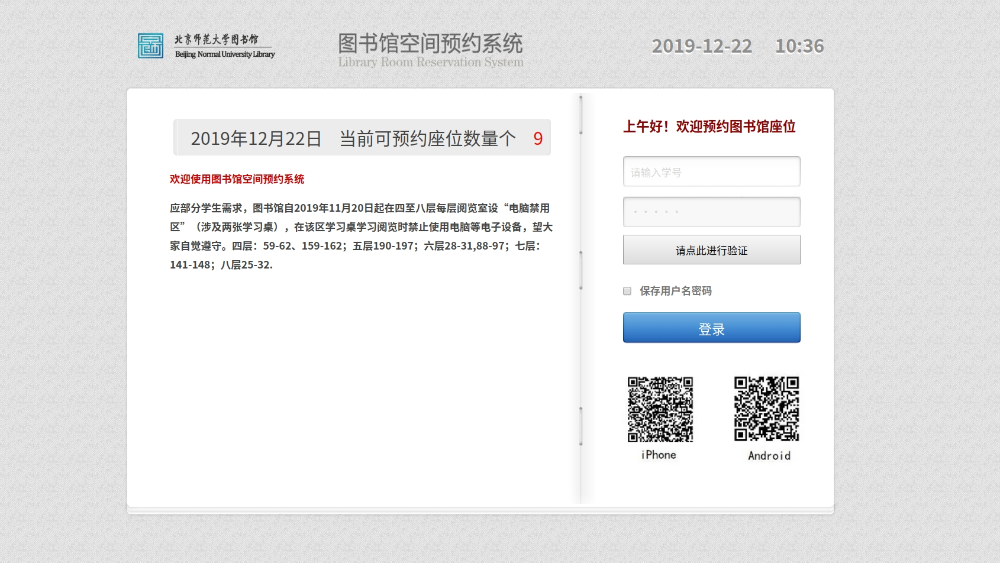
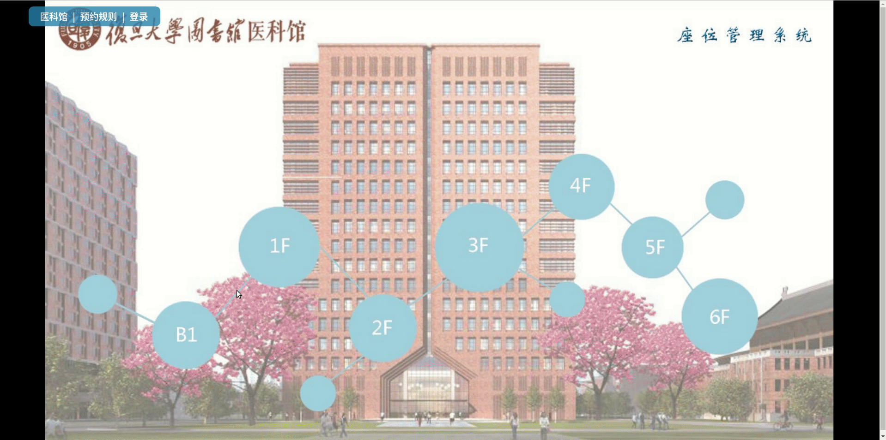
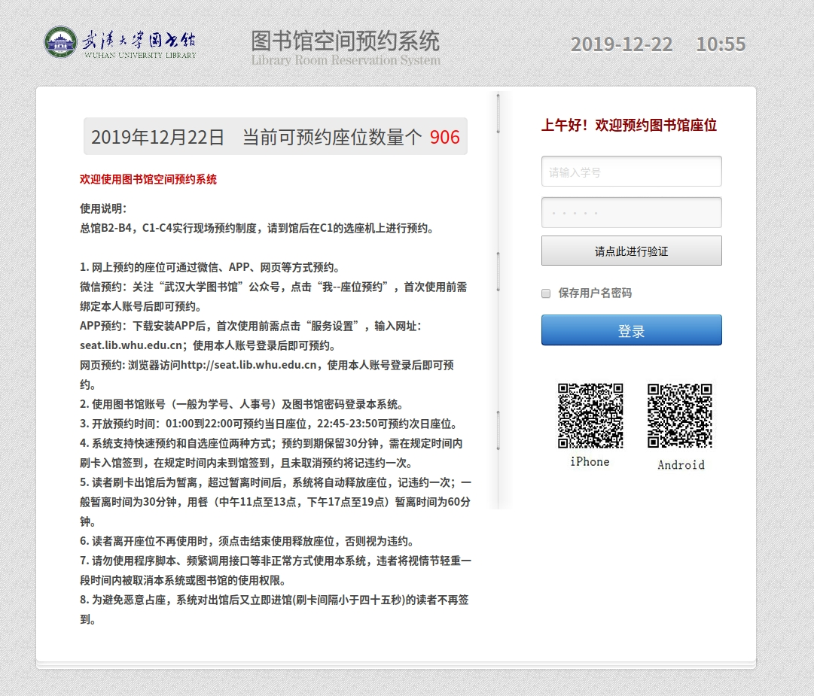
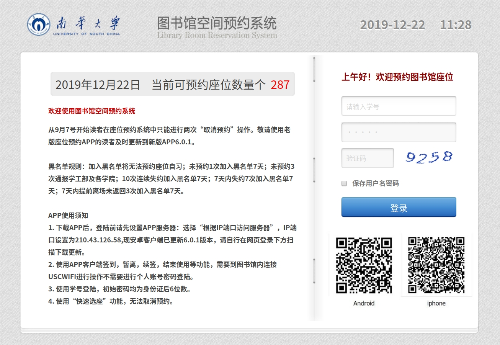
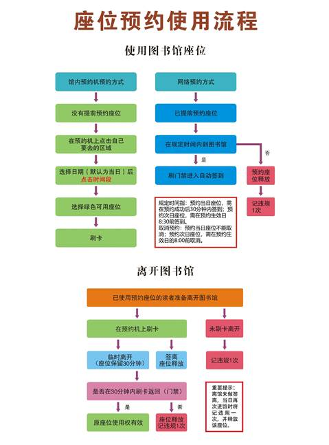

# 大学座位预约实现现状收集

## [清华大学人文社科图书馆](http://hs.lib.tsinghua.edu.cn/content/434)

**[预约登录入口](http://seat.lib.tsinghua.edu.cn/roompre/)**

#### 预约规则

``` 
******************图书馆阅览座位预约规则******************
1、读者可登录人文社科图书馆阅览座位预约系统（http://seat.lib.tsinghua.edu.cn/roompre）预约每天早晨开馆时的座位。预约系统用户名
为学号/工作证号，密码同清华大学信息门户系统【持临时借书证/阅览证（条码卡）的读者暂不能预约阅览座位】。
2、文科图书馆F2、F3、F4楼层以及G层自修室的阅览座位可以有条件地预约使用。
3、预约系统开放时间为每日20:00至次日7:30。读者可以预约次（/当）日早8:00开馆时的座位。
4、预约座位保留至8:30。成功预约座位的读者应在8:30前在通道机上刷卡入馆，并可直接前往所预约座位而无需再在选位机上操作；系统会自
动将座位状态从“预约”改为“在用”。
5、成功预约座位的读者如未于8:30前在通道机上刷卡入馆，将被记“预约违规”1次，同时预约座位将释放给其他读者选用。
6、“预约违规”满3次后，读者将被停止预约权限10天；同时“预约违规”计次归零。（“预约违规”有别于“使用违规”——“预约违规”满
3次后仍可进行现场选位操作；“使用违规”满3次后既不能进行现场选位操作，也不能进行预约操作。）
7、读者如遇紧急事务无法正常赴约，可在早上预约系统关闭前登陆预约系统取消预约。
8、暂定每年度8月31日清除全部用户的全部违规记录。
9、如有关于阅览座位预约规则及系统的咨询，请致电62798676或发送邮件至hs-sys@lib.tsinghua.edu.cn。
```

## [北京师范大学图书馆](http://www.lib.bnu.edu.cn/content/zuo-wei-yu-yue-0)

**[预约登录入口](http://219.224.23.151/login?targetUri=%2F)**



#### 预约规则

```
以下是座位系统的使用说明：
一、预约座位：
1.可通过网页、APP实现在线预约。
2.座位预约成功后，可在触摸屏一体机上刷卡签到，也可通过APP和门禁闸机签到（仅限图书馆主馆），英东楼和图书馆南馆必须在触摸屏一体机上刷卡签到。签到时间是预约起始时间前30分钟至预约起始时间后30分钟。
3.19:30到23:30之间可以预约第二天的座位。
二、选座和使用：
1.可通过触摸屏一体机选座、签到、暂离、续座、释放座位。
2.可通过APP实现选座、签到、释放、查看个人状态（仅限图书馆主馆，必须连接图书馆WIFI:BNU-Mobile）。
3.临时离开座位必须选择“暂离”，暂离时间是30分钟（11：00-13：00和16：30-18：30两个时段保留60分钟）
三、结束使用：
1.    读者用满所选时段即可离馆，无需刷卡释放座位。
2.    读者提前离开座位必须在选座机或APP上释放座位。
四、违规说明：
1.以下三种情况属于违规操作：
1）读者提前离开座位但未释放；
2）读者选择“暂离”但未在规定时间内返回；
3）读者预约座位却未在规定时间内签到。
2.若读者有三次违规操作，则系统自动列入黑名单，不可通过系统选座。解除黑名单的方式有两种：
1）七天后自动解除；
2）选择做义务巡视员8个小时，经老师确认后解除。
五、注意事项：
1）座位系统密码等同于一卡通查询密码，查询密码初始密码为身份证后六位，留学生初始密码666666
2）每日可在线预约座位数量限额：座位总数的百分之三十。如果超出在线预约限额，仅可通过图书馆现场选座。
3）若使用座位发生纠纷，请在“我的预约”查询进出记录。
4）选座系统密码与一卡通查询密码一致。
5）读者只能在主馆连接图书馆wifi后使用手机APP选座、签到、暂离、续座、释放座位。
6）读者预约座位后，在图书馆主馆可通过门禁闸机自动签到，英东楼和图书馆南区必须在触摸屏一体机上刷卡签到，签到时间必须在预约时间的前半个小时和后半个小时。
7）读者只能预约百分之三十的座位，其余百分之七十的座位必须在图书馆通过触摸屏一体机或者APP现场选座功能选座。
8）请爱护机器，轻轻触摸！
咨询电话：58805287尹老师
咨询信箱：yinxq@lib.bnu.edu.cn
```

## [复旦大学图书馆医科馆](http://www.library.fudan.edu.cn/medical/2018/0112/c739a3643/page.htm)

**[预约登录入口](http://mlibic.fudan.edu.cn/web/index/area/1)**



```
一、座位预约规则。
1、医科馆B1座位24小时开放；其他楼层开放时间8：00--22：00。
2、读者预约当日或次日的座位（B1只提供当日座位预约）,预约成功后读者可以使用该座位至当日座位关闭时间；预约系统登陆用户名为学号,密码为校园卡统一身份认证密码。
3、预约当日座位的读者预约成功后不能再取消,并在20分内刷卡进入图书馆签到。
4、预约次日座位的读者,需在次日早上8：20前刷卡进入图书馆签到。
5、预约后未签到的读者将被记录违规1次,未签到违规满3次,将被暂停使用图书馆的座位与空间的预约权限7天。
6、如需取消次日的预约,需在次日7：30前取消预约,具体操作：点击我的中心--我的预约--取消预约。
7、读者刷卡出馆,座位自动释放(座位未办理临时离开)。
8、临时离开：出馆前在预约机上选择“临时离开”并刷卡，座位保留60分钟。已选择“临时离开”的读者返回座位时，须签到即可继续使用原座位，签到方法有两种：1、从通道机刷卡入馆，2、未出馆读者在预约机上刷卡签到；60分钟内未返回签到，系统将自动释放座位以供他人选用，并记录临时离开未归违规1次，临时离开未归违规满3次,将被暂停使用图书馆的座位与空间的预约权限7天。
9、读者须维护室内秩序，勿用物品占位和随意移动椅子，工作人员有权清理占座物品，丢失责任由占位者自负。
二、研究室及研讨桌预约规则。
1、读者预约当日或次日的研究室、研讨桌，预约登录系统用户名为学号,密码为校园卡统一身份认证密码。
2、预约时须填写必要的预约申请，多人研究室需要提交其他参与人员学号。
3、研讨桌及3-6层研究室开放时间为每日8：00--22：00，各层研究室每次预约最短1小时，最长5小时。
4、每人每日可预约使用研究室或研讨桌一次；单人研究室只能预约者本人使用,不得与其他人共用,一经发现管理员将记预约者违约1次。
5、预约成功后,开始时间前30分钟内可刷卡签到(之前没有其他预约者）。距离预约开始前30分钟，可取消预约。取消具体操作：点击我的中心--我的预约--取消预约。
6、预约成功后,预约成员须按时刷卡签到；多人研究室及研讨桌至少需要3人刷卡签到；预约开始20分钟后，若成员刷卡签到人数未达到研究室、研讨桌最少使用人数，系统记录申请人违约一次，并且释放本次预约。违约三次后将被暂停使用图书馆的座位与空间的预约权限7天。
7、读者进入研究室后须首先查看设备是否完好，有问题请及时联系工作人员（联系方式在预约网页“房间信息”或门口刷卡机上查看），否则，本次设备故障由预约人负责。
8、研究间使用完成后，使用者负责将室内物品及设备恢复使用前的状态，带走个人物品及废弃物，关好门窗，关闭电源及房门。
三、大型研究室预约规则。复旦大学图书馆医科馆大型研究室申请表。(点击下载)
308,408,510三间大型研究室供师生进行项目或者课题的短时小型讨论，由于资源有限其它目的需求请勿申请。预约申请前请仔细阅读以下预约使用规则：
1、申请使用复旦大学图书馆医科馆大型研究室，需如实填写《复旦大学图书馆医科馆大型研究室申请表》，并提前三个工作日将电子版申请表邮件发送至libic@fudan.edu.cn，由图书馆负责人员人工审核（人工审核工作时间：工作日周一至周五8：00-11：30，13：30-17：00，法定假日除外）；审核结果将通过邮件告知，如审核通过，纸质版申请表需由部门负责人签字并加盖公章，并在研讨预约时间开始前24小时以上交由图书馆备案（送至医科馆723房间）。
2、复旦大学图书馆医科馆大型研究室申请使用期限为半天至1天。
3、308,408的开放时间为每日8：00-21：00，最多可容纳16人；510的开放时间为8：00-21：00，最多可容纳11人。
4、每个联系人/部门每个月申请大型研究室不得超过3次。
5、申请成功后，如需取消申请，需至少早于申请开始时间24小时邮件或者电话通知图书馆，否则记研讨负责人违规一次。
6、申请成功后，所有成员须按时至医科馆一楼签到，签到人员需携带与申请表中填写个人信息（学号/工号/身份证）相一致的身份证件，由保安核对相关人员的身份信息；研讨负责人的证件需临时押至一楼保安处，待研讨结束、确认无异常情况后，再行取回。
7、成员签到人数达到大型研究室最少使用人数（8人），方可正常使用研究室；如预约时间开始20分钟后，成员签到人数未达到大型研究室最少使用人数（8人），系统记录研讨负责人违约一次，并且释放本次申请。违约三次后将被暂停使用图书馆的座位与空间的预约权限7天。
8、读者进入研究室后须首先核对并查看设备是否完好，有问题请及时联系工作人员，相关信息可在预约网页“房间信息”或研究室门口刷卡机上查看。否则，本次设备故障由研讨负责人负责。
9、研究室使用完成后，使用者负责将室内物品及设备恢复使用前的状态，带走个人物品及废弃物，关好门窗，关闭电源及房门。使用期间所有的设备损坏或者遗失，需由使用人负责赔偿，并需及时告知图书馆工作人员，否则记研讨负责人违规1次。
```

## [武汉大学图书馆](https://www.lib.whu.edu.cn/web/index.asp?obj_id=826)

**[预约登录入口](https://seat.lib.whu.edu.cn/login?targetUri=%2F)**



```
使用说明：
总馆B2-B4，C1-C4实行现场预约制度，请到馆后在C1的选座机上进行预约。

1. 网上预约的座位可通过微信、APP、网页等方式预约。
微信预约：关注“武汉大学图书馆”公众号，点击“我--座位预约”，首次使用前需绑定本人账号后即可预约。
APP预约：下载安装APP后，首次使用前需点击“服务设置”，输入网址：seat.lib.whu.edu.cn；使用本人账号登录后即可预约。
网页预约: 浏览器访问http://seat.lib.whu.edu.cn，使用本人账号登录后即可预约。
2. 使用图书馆账号（一般为学号、人事号）及图书馆密码登录本系统。
3. 开放预约时间：01:00到22:00可预约当日座位，22:45-23:50可预约次日座位。
4. 系统支持快速预约和自选座位两种方式；预约到期保留30分钟，需在规定时间内刷卡入馆签到，在规定时间内未到馆签到，且未取消预约将记违约一次。
5. 读者刷卡出馆后为暂离，超过暂离时间后，系统将自动释放座位，记违约一次；一般暂离时间为30分钟，用餐（中午11点至13点，下午17点至19点）暂离时间为60分钟。
6. 读者离开座位不再使用时，须点击结束使用释放座位，否则视为违约。
7. 请勿使用程序脚本、频繁调用接口等非正常方式使用本系统，违者将视情节轻重一段时间内被取消本系统或图书馆的使用权限。
8. 为避免恶意占座，系统对出馆后又立即进馆(刷卡间隔小于四十五秒)的读者不再签到。
```

## [西北工业大学图书馆](https://tushuguan.nwpu.edu.cn/test2019/dzfw2019/yxj_zwyy2019.htm)

**[预约登录入口](http://202.117.88.170:81/ClientWeb/xcus/ic2/Default.aspx)**

```
座位预约
　　友谊校区图书馆东馆目前有自习阅览座位774个，分布在二楼至五楼各区域，为解决高峰期占座现象，确保同学们能公平、高效地使用座位，图书馆将于11月7日起，在友谊校区图书馆东馆开通试用智能座位预约管理系统。
　　系统提供两种预约入口：
　　1、Web端预约
　　由图书馆主页进入座位预约管理系统进行网上预约，用户名、密码同西北工业大学翱翔门户系统。
　　2、手机端预约
　　关注西北工业大学图书馆微信公众号，进入“服务指南”-“研修间/座位预约”，经西北工业大学翱翔门户系统认证成功后，即可进行预约
    智能座位预约管理系统常见问答
    Q:可以预约多久呢？
    A: 30分钟-7小时。可提前24小时预约，也可当即生效。 
    Q：我一天能预约几次？
    A：在开放时间内，全天预约次数不限，但一次只能预约一个时间段，在本次座位使用结束后，才能预约下一次
    Q:如何知道自己预约成功了呢？
    A：有三种方式可以知道哦！①在微信端[预约提醒]中查看预约凭证；②在注册邮箱中查收邮件通知；③在Web端[个人中心]查看预约信息   
    Q：一不小心迟到了怎么办呢？
    A：超过预约时间30分钟，仍未刷卡入馆就坐预约座位，预约就自动取消了，而你，就违约了！违约累计3次，将被封号3天！！！
    Q：我要是中途想离开一会儿呢？
    A：读者在座位使用过程中如需暂时离开，系统将保留其座位使用权限30分钟，超过30分钟仍未返回，该座位会自动释放给 其他读者预约使用。 
    Q：预约座位后，看到座位上有其他同学怎么办？
    A：座位预约管理系统上线试运行后可能有部分同学还不知道，我们将加大宣传和巡查力度，保障已预约座位同学的利益。如果再遇到类似问题可以让图书馆工作人员出面劝离未预约座位的同学，电话：88492361。 
    Q：我预约了座位，临时有事不能来怎么办？
    A:读者可以在预约时间生效前取消预约，否则系统将自动记录违约。取消预约可以在[个人中心]-[预约记录]中找到预约记录，点击删除操作即可。
    Q:我在图书馆预约座位后，还需要重新刷卡入馆吗？
    A:读者在使用座位预约系统时，先刷卡进馆、再预约座位，或先预约座位再刷卡进馆，都是允许的；刷卡当天有效，仅刷一次即可。
    ```
    
    ## [南华大学图书馆](http://tsg.usc.edu.cn/info/1002/1496.htm)

**[预约登录入口](http://210.43.126.58/login?targetUri=%2F)**
    
    
   
    
    ```
    触屏机预约使用须知：
说明：触屏机位于图书馆。在触屏机的读卡器位置直接刷校园卡即可登陆进行选座。
自主选座：可以自主地根据阅览室座位布局图选择座位。
随机派座：系统会为您随机分配所选时长的座位；在高峰期时仅可使用此方式选座。
使用过程：
预约步骤：1、选择预约结束时间；→ 2、选择自习的教室；→3、选择自习的座位；→4、确认，即可得到凭证；→5、退出操作
说明：1.现场选座的开始时间均为当前时间；
2.预约凭证作为您使用座位的合法依据。可以将此结果拍照或手抄。
暂离步骤：1、刷卡；→2、点击“暂时离开”；→3、退出操作，离场；→4、返场，刷卡点击“返回场馆”；→5、退出操作
说明：1、如果需要暂时离开座位，可在触屏机再次刷卡进行暂离操作，系统将为您保留座位30分钟的时长。需要注意的是，您需要在30分钟内返回并在触屏机上进行点击“返回场馆”操作。
2.如果未在30分钟内返回或未进行返回操作，系统将自动结束此次使用，回收座位并记录违约。
续座步骤：1、刷卡；→2、点击“续约座位”；→3、选择续约结束时间；4、确认，获取续约凭证；→5、退出操作
说明：1.需要注意的是，如果其他读者通过网页或APP预约了该座位的后续的某些时段，那么可续座的时间可能会受到影响。
2.续座不成功时，可结束当前的使用。再选择其他座位。
结束使用步骤：1、刷卡；→2、点击“结束使用”；→3、提示“您已结束当前预约”，结束成功；→5、退出操作
说明：1.如未到结束时间需要结束此次使用，可在触屏机再次刷卡进行结束使用操作。
2.在结束时间到达后离开，无需进行任何操作。
特别提醒：1、中午时段只有一楼自习室可以预约。（部分不开晚班阅览室晚上也是不能预约的）
手机客户端预约使用须知
说明：1.下载安装APP后，第一步需要点击“服务器设置”，设置“根据IP端口访问服务器”，横线上需要填写，如：210.43.126.58:80。注：Iphone版本的自习助手升级后IP地址设置成210.43.126.58:8443。
2.登陆账号使用学号，初始密码为“1”。
3.除了预约和取消预约功能，其他功能均要在连接了图书馆的USCWIFI但是不需要进行个人帐号密码登录就可以进入校园网和相关学习网站进行操作。
4.预约签到时间为预约时间的前后15分钟内，例如：预约时间为9:00，允许预约签到的时间为8:45-9:15，共30分钟；在预约开始之前的15分钟内无法取消预约，例如：预约时间为9:00，在8:45之前允许取消预约。
5.如果读者一直使用到预约时间结束，系统将自动结束预约，无需任何操作。
预约步骤：1、输入账号密码登陆；→2、点击选择“自选座位”；→3、选择场馆和日期，点击查询；→4、点击选择教室；→5、点击选择座位；→6、点击选择开始时间和结束时间；→7、确认，获取凭证；→8、预约完成
说明：“快速选座”选座开始的时间为当前时间，建议连接图书馆WiFi使用（5月22日以后可以使用图书馆内的USCWIFI），系统会自动签到，否则需要在15分钟内，连接图书馆wifi进行签到。
暂离步骤：1、连接图书馆WiFi；→2、登录APP；→3、点击“暂离”
返场步骤：1、连接图书馆WiFi；→2、登录APP；→3、点击“返回”，提示成功登记入场
结束使用步骤：1、连接图书馆WiFi；→2、登录APP；→3、点击“结束使用”
说明：读者想在预约时间内提早走，需要进行结束使用操作，点击结束使用按钮，会提示结束使用请求成功。
“我的预约”功能说明：
1、读者可以在“我的预约”中可查看到预约记录，使用记录及履约情况。
2、如果想要取消预约，在规定时间内进入“我的预约”，点击可取消按钮，会提示取消预约成功。
 
网页预约使用须知
说明：1、网页上预约包括“自选座位”、“布局选座”和“常用座位”。
2、图书馆查询机上进行网页预约，默认为到场签到；否则需要在触屏机或者APP上进行签到。
3、网页预约拥有“常用座位”功能，它记录的是读者正常使用完座位的信息，读者可以在“常用座位”中选择自己经常使用的座位，省去了找座位的麻烦（如果常用座位被其他人预约使用了，请另外选择座位进行预约）。
自选座位步骤：
1.登陆网站：http://seat.usc.edu.cn/login?targetUri=%2F（或者IP为210.43.126.58）；→2.输入账号密码和验证码登陆→自选座位：可选择日期、场馆、教室、时长、开始时间和结束时间进行座位查询，或者使用“座号查询”→3.查询到座位后，进行选择座位并确定预约时间段。→4.确认预约，获得凭证
布局选座步骤：
1.登陆网站：http://seat.usc.edu.cn/login?targetUri=%2F（或者IP为210.43.126.58）；→2.输入账号密码和验证码登陆; →3.布局选座：选择日期、场馆、楼层进行教室查询; →4.选择教室，进入布局图选座; →5.点击座位，选择开始时间和结束时间; →6.确认预约，获得凭证
常用选座步骤：
1.登陆网站：http://seat.usc.edu.cn/login?targetUri=%2F（或者IP为210.43.126.58）→2.输入账号密码和验证码登陆；→3.选择“常用选座”；→4.点击座位，选择开始时间和结束时间；→5.确认预约，获得凭证。
 
重要提示：试运行期间，可能存在“预约的读者”和“没预约直接入座的读者”选择同一座位的情况，“预约的读者”享受优先权，“没预约的读者”必须让座。为避免这种情况，希望每一个需要阅览座位的入馆读者都进行预约选位。试运行期间可能存在多次失约情况，我们将定时清除违规记录。
```

## [江苏大学图书馆](http://lib.ujs.edu.cn/content.jsp?urltype=tree.TreeTempUrl&wbtreeid=1511)

**[登录入口](http://libspace.ujs.edu.cn/web/index/area/1)**



```
座位预约方式：
方式一手机预约：“江苏大学图书馆”微信公众号—我的图书馆—我要找座
方式二网页预约：登录图书馆主页—我的图书馆—我的预约座位或直接登录http://libspace.ujs.edu.cn
方式三现场预约：图书馆一楼大厅座位预约机预约
座位签离&临时离开方式：
方式一 ： 一楼大厅预约机签离
方式二： 各阅览室预约终端签离&临时离开
方式三 ：通过图书馆公众号微信端扫描二维码签离或临时离开
温馨提示：
手机微信端第一次使用需要绑定江苏大学统一身份认证账号登录。
临时离开座位保留时间是30分钟，在吃饭时间中午11:00～12:30及晚上16:30～18:30临时离开可以保留座位90分钟
```

## [山东聊城大学图书馆](http://210.44.126.22)

**[预约规则 PDF](files/山东聊城大学图书馆座位预约.pdf)**
